# BOOKCORPUSBUILDER Operator Manual

```text
Application version:  1.0.0rc1  (src/bookcorpusbuilder, pyproject.toml)
Architecture status:  FROZEN at v1.0 (see docs/GOVERNANCE.md)
Manual status:        Current — reflects the application exactly as installed
```

This manual documents the seven-workspace desktop application exactly as it
exists today. Every screenshot in this manual was captured from the real
application, driven through its real service layer against disposable
practice books — no control described here is imagined, and no control that
exists in the application has been omitted because it seemed unimportant.

## Contents

1. Introduction
2. Safety and data integrity
3. Starting the application
4. Understanding the main window
5. Settings
6. Library workspace
7. Structure Builder — choosing an outline source
8. Structure Builder — pasting and parsing an outline
9. Structure Builder — reviewing and approving the outline
10. Page Alignment — conceptual explanation
11. Page Alignment — buttonology
12. Page Alignment — step-by-step worked example
13. Extraction workspace
14. Corpus Browser
15. Run History
16. Output folders and files
17. Scanned PDFs
18. Troubleshooting
19. Daily operator checklist
20. Quick-start guide
21. Glossary
22. Governance note

## Ten-minute workflow

If you only read one page of this manual, read this one.

```text
1.  Add PDF                 (Library)
2.  Paste or detect outline (Structure Builder → A. Create Structure)
3.  Parse                   (Parse Preview)
4.  Review                  (Structure Builder → B. Review Outline)
5.  Approve                 (Approve Outline)
6.  Map chapter pages       (Page Alignment — add anchors)
7.  Approve mapping         (Verify and approve mapping)
8.  Extract                 (Extract → Extract Verified Corpus)
9.  Search                  (Corpus Browser)
10. Open source              (Corpus Browser → Open Source PDF / in-app preview)
```

Chapters 6 through 15 walk through this sequence in full detail, including
every place it can legitimately stop and ask you for a decision. Read those
chapters before processing your first real book — the "ten minutes" assumes a
book with a clean table of contents and no page-mapping surprises, which is
not every book.

---

# 1. Introduction

## What BOOKCORPUSBUILDER does

BOOKCORPUSBUILDER turns a PDF of a scholarly book into a set of individually
addressable, provenance-tracked text sections: one file per chapter or
section, plus a machine-readable JSONL file and a manifest, all traceable back
to the exact physical page of the exact source PDF they came from.

## What it does not do

- It is **not** a PDF reader. Its built-in preview shows one page of extracted
  text at a time to support verification, not general reading.
- It is **not** an OCR tool. It can tell you a PDF is *likely scanned*; it does
  not read scanned pages for you (Chapter 17).
- It is **not** an AI chat application. One workspace (Structure Builder) can
  optionally call a local Ollama model to *propose* candidate outline rows,
  but every proposal is schema-validated and requires human approval before
  it can affect anything (Chapter 7).

## Operator-governed philosophy

Every stage that could silently guess is instead required to stop and ask:

```text
PDF
  → Deterministic parser (finds candidate headings and page numbers)
  → AI candidate (optional, never mandatory)
  → Schema validation
  → Human review and approval
  → Approved outline
  → Human-verified page mapping
  → Extraction
```

Human verification always overrides automation. Nothing you have not reviewed
becomes part of the corpus.

## Five things that are easy to confuse

| Term | Meaning |
|---|---|
| **PDF** | The source file itself. Never modified by this application. |
| **Outline** | The list of section titles and printed page numbers you approve. |
| **Page mapping** | The verified rule that converts a *printed* page number into the *physical* PDF page that actually holds it. |
| **Corpus** | The extracted text output of one run: TXT files, one JSONL file, one manifest. |
| **Extraction run** | One specific, timestamped execution that produced one corpus. Old runs are never overwritten. |

## Workflow overview

```text
Library  →  Structure Builder  →  Page Alignment  →  Extract  →  Corpus Browser  →  Run History
```

**Settings** is not a step in this sequence — it configures where all six
other workspaces read and write, and can be opened at any time.

## Architecture-freeze status

As of v1.0 the seven-workspace architecture, the outline schema, the page
mapping model, and the extraction pipeline are a frozen contract
(`docs/GOVERNANCE.md`). This manual documents that frozen contract. It will
not describe features that do not exist yet, and it will be kept in sync as
long as the contract does not change.

---

# 2. Safety and data integrity

Read this chapter before touching a real book.

- **Source PDFs are never modified.** Every stage reads the PDF; none of them
  write to it.
- **Approved outlines are hash-bound.** Once you approve an outline, its
  approval record stores the SHA-256 of both the outline file and the source
  PDF at that moment. If either changes afterward, the application detects the
  mismatch and blocks extraction rather than silently using stale data.
- **Printed pages and physical pages are different things.** The number
  printed at the bottom of a page (`"21"`) and that page's actual position in
  the PDF file (its 247th page, say) are frequently not the same number.
  Chapter 10 explains why and Chapter 11 shows you how to verify the
  difference for a specific book.
- **Page mapping must be approved before extraction can run.** The Extract
  workspace's preflight check (Chapter 13) will not let you proceed on an
  unapproved or unresolved mapping.
- **Cancelled runs are not promoted.** If you cancel an extraction in
  progress, its temporary output is discarded — no partial run is ever left
  looking like a completed one.
- **Previous completed runs remain intact.** Extraction always writes to a new,
  timestamped run folder (Chapter 15). Nothing you did in a prior run is
  overwritten by a later one.
- **Use a disposable profile for practice or testing.** Set the
  `BOOKCORPUSBUILDER_CONFIG` environment variable to a throwaway JSON file
  path before launching (Chapter 3) so your real library, outlines, and
  corpus are never touched by practice work — this is exactly how every
  screenshot in this manual was produced.
- **Analytical headings are not automatically trustworthy extraction
  boundaries.** A heading detected inside a chapter (e.g. a sub-argument or a
  thematic aside) is metadata, not a verified section boundary, until its
  page location has actually been checked.

> **Never approve a mapping merely because the page numbers look plausible.
> Verify chapter openings visually**, by reading the extracted text preview
> next to the anchor you are about to add (Chapter 12).

---

# 3. Starting the application

**Purpose.** Launch BOOKCORPUSBUILDER and confirm it started correctly.

**Before you begin.** You need a terminal and a Python environment with the
`gui` extra installed. Two environments are referenced across this project's
documentation, for two different situations:

- **A fresh checkout with no retained environment**: follow `README.md`'s
  Setup section (`python3 -m venv .venv && .venv/bin/pip install -e '.[gui]'`)
  and launch with `.venv/bin/bookcorpus-gui`.
- **This specific retained checkout**, where a pre-built environment at
  `../BOOKCORPUSBUILDER-gui-venv` (sibling to the project directory) is kept
  alongside it specifically because the project's own bundled `.venv/` here
  is a known-broken build (see `docs/IMPROVEMENT_ROADMAP.md`, Phase 1) — the
  steps below assume this retained environment, not a fresh checkout.

If you are not sure which situation applies, check whether
`../BOOKCORPUSBUILDER-gui-venv` exists as a sibling to this project directory
on your machine; if it does not, use the `README.md` path instead.

**Steps.**

1. Open a terminal.
2. Change to the project directory:

   ```bash
   cd /media/ambijat/SOPRANO2/GPT_workflow/BOOKCORPUSBUILDER
   ```

3. Launch the application using the retained GUI environment:

   ```bash
   ../BOOKCORPUSBUILDER-gui-venv/bin/bookcorpus-gui
   ```

4. **For practice or documentation work only** — launch against a disposable
   profile instead of your real one, so nothing you do here touches your real
   library or corpus:

   ```bash
   BOOKCORPUSBUILDER_CONFIG=/tmp/bookcorpusbuilder-practice-profile.json \
     ../BOOKCORPUSBUILDER-gui-venv/bin/bookcorpus-gui
   ```

5. Close the application normally — from the window's own close control, or
   `Ctrl+Q`/`Alt+F4` depending on your desktop environment. Settings and
   window layout are saved automatically on close.

**Expected result.** A window titled **BOOKCORPUSBUILDER** opens, showing the
seven-workspace navigation list on the left and the **Library** workspace
selected by default (Figure 1).

**Figure 1 — the application immediately after launch.**


*Alt text: BOOKCORPUSBUILDER main window on first launch, showing the seven-item workspace navigation list and an empty Library table.*

If images are not available to you, the window layout is: a narrow list of
seven workspace names on the left; the active workspace fills the rest of the
window; a status line across the top shows which book is currently selected
and whether it is ready for extraction.

**Alternative launch** (equivalent, useful for capturing logs or running under
a debugger):

```bash
../BOOKCORPUSBUILDER-gui-venv/bin/python -m bookcorpusbuilder.gui.app
```

**Common mistake.** Running `bookcorpus-gui` with the *project's own*
`.venv` instead of `../BOOKCORPUSBUILDER-gui-venv`. The project's bundled
`.venv` is a known-broken build environment (see `docs/IMPROVEMENT_ROADMAP.md`,
Phase 1) and is not a supported way to run the GUI.

**Recovery.** If the command is not found or exits immediately with an
`ImportError` mentioning PySide6, you are using the wrong Python environment —
switch to `../BOOKCORPUSBUILDER-gui-venv/bin/bookcorpus-gui` exactly as shown
above.

---

# 4. Understanding the main window

The seven workspaces, in navigation order, are:

1. **Library** — register PDFs and see their overall status at a glance.
2. **Structure Builder** — create and approve a book's outline.
3. **Page Alignment** — verify printed-to-physical page mapping.
4. **Extract** — run and monitor extraction.
5. **Corpus Browser** — search and inspect extracted output.
6. **Run History** — audit every extraction run, past and present.
7. **Settings** — configure folders and defaults; supports all six workspaces
   above rather than being a step in the workflow itself.

## Shared conventions across every workspace

- **Selected-book context.** Most workspaces act on "the selected book." You
  choose it in Library; the header bar always shows which book (if any) is
  currently selected.
- **Status messages.** Actions report their result in the header's status
  strip (temporary messages) or directly inside the workspace (validation
  panels, logs).
- **Resizable splitters.** Every workspace with a two- or three-pane layout
  (Page Alignment, Corpus Browser, Structure Builder's outline review) has a
  draggable divider between panes. Its position is remembered between
  sessions.
- **Table column resizing, movement, and "Best Fit Columns."** Every table in
  the application can have its columns dragged wider/narrower or reordered.
  A **Best Fit Columns** button is available near most tables to reset column
  widths to fit their current contents in one click.
- **Header right-click menu and Shift-wheel horizontal scrolling.** Right-
  clicking a table's column header offers a menu to show or hide columns;
  holding Shift while scrolling the mouse wheel over a wide table scrolls it
  horizontally instead of vertically.
- **Persistent window and column layout.** Window size and position, splitter
  positions, and per-table column widths are all saved automatically and
  restored the next time you launch the application with the same
  configuration profile.

**Figure 2 — a labelled overview of the main window.**

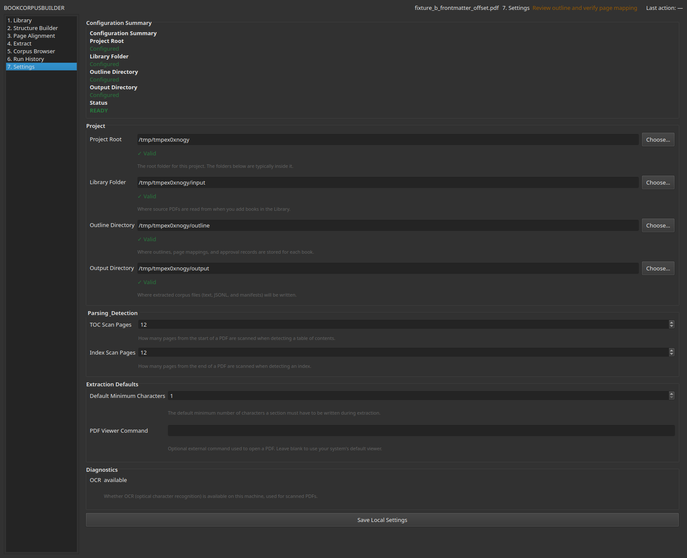

*Alt text: Settings workspace showing folder fields, scan-page settings, and OCR availability.*

Callouts for Figure 2:

1. Navigation list (left) — the seven workspaces described above.
2. Active workspace content (right) — changes completely depending on which
   workspace is selected; Settings is shown here as an example.
3. Each folder field has an inline **Choose…** button that opens your
   operating system's native folder picker.

---

# 5. Settings

**Purpose.** Confirm or change where BOOKCORPUSBUILDER reads PDFs from and
writes outlines/corpus output to, and check whether OCR is available on this
machine.

**Steps.**

1. Open **7. Settings** in the navigation list.
2. **Project Root** — the base folder this configuration profile is anchored
   to. Changing it does not move any files; it only changes where the
   application looks next.
3. **Input Pdf Dir** — where PDFs added via Library are copied to.
4. **Outline Dir** — where outline drafts, approvals, and page-mapping records
   are stored, one JSON/CSV set per book.
5. **Output Dir** — where extraction runs, corpus files, and run-history
   records are written.
6. Use each field's **Choose…** button to pick a folder with your operating
   system's native dialog, or edit the path text directly.
7. **OCR** shows `available` or `unavailable` depending on whether a
   `tesseract` binary is found on your system `PATH` at the moment Settings
   loads. This is a status indicator only — see Chapter 17 for what it does
   and does not mean.
8. **Profile isolation** — which settings file is being edited is controlled
   by the `BOOKCORPUSBUILDER_CONFIG` environment variable set before launch
   (Chapter 3). Two terminals launched with two different values of that
   variable have entirely independent folders, histories, and libraries.
9. Click **Save Local Settings** to persist your changes and immediately
   apply them to every workspace.

**Figure 3 — the Settings workspace**, shown in Figure 2 above.

**What should not be changed casually:** repointing **Input Pdf Dir**,
**Outline Dir**, or **Output Dir** on a profile that already has real books
registered effectively disconnects the application from all of that existing
data (the paths recorded per book do not move with you). Only repoint these
mid-project if you are deliberately migrating storage, and back up the old
folders first.

> **Use a disposable profile for anything experimental.** Point
> `BOOKCORPUSBUILDER_CONFIG` at a throwaway file, as shown in Chapter 3, before
> testing settings changes you are not sure about.

---

# 6. Library workspace

**Purpose.** Register PDFs, and see the processing status of every registered
book without opening any of the other six workspaces.

**Figure 4 — the empty Library workspace**, before any book has been added.

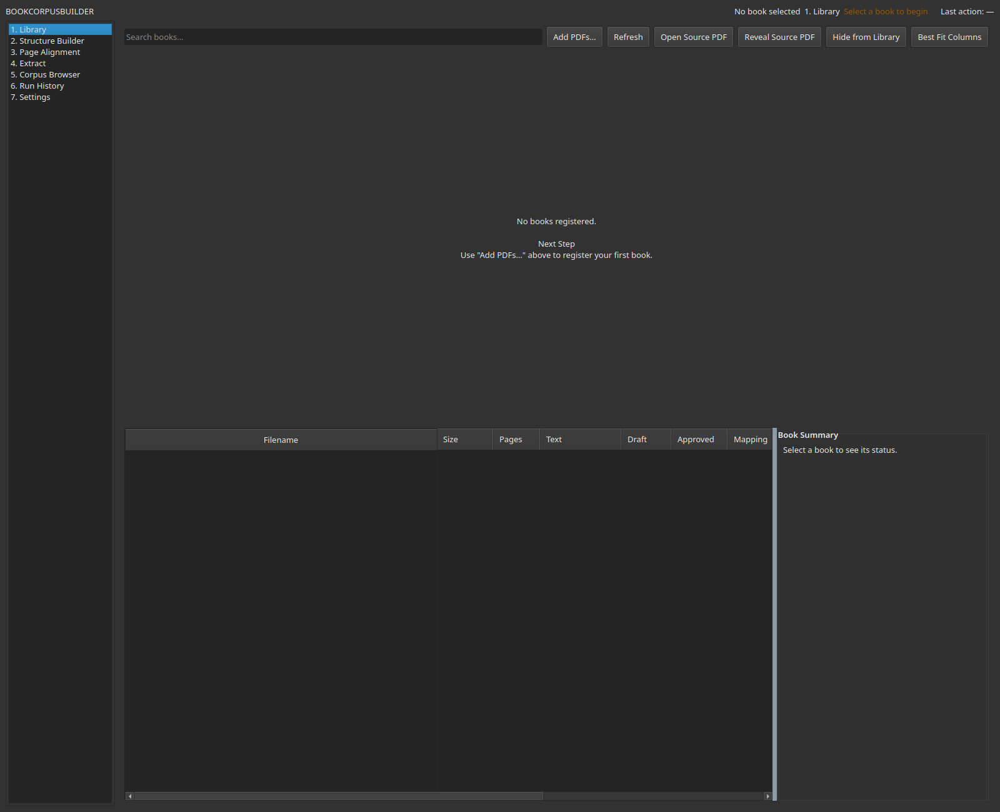

*Alt text: Empty Library table with a centered prompt to add PDFs.*

**Steps: adding a book.**

1. Press **Add PDFs…**. Your operating system's native file picker opens;
   select one or several PDF files.
2. Each selected PDF is copied into the canonical input folder (Settings →
   Input Pdf Dir) and registered by its SHA-256 hash.
3. **Duplicate detection is automatic and by content, not filename.** If a
   file with the same SHA-256 hash is already registered, the add is refused
   with a message naming the existing registration — the same PDF under a
   different filename will not create a second entry.
4. The table refreshes to show every registered book.

**Figure 5 — the Library after three practice books have been added.**

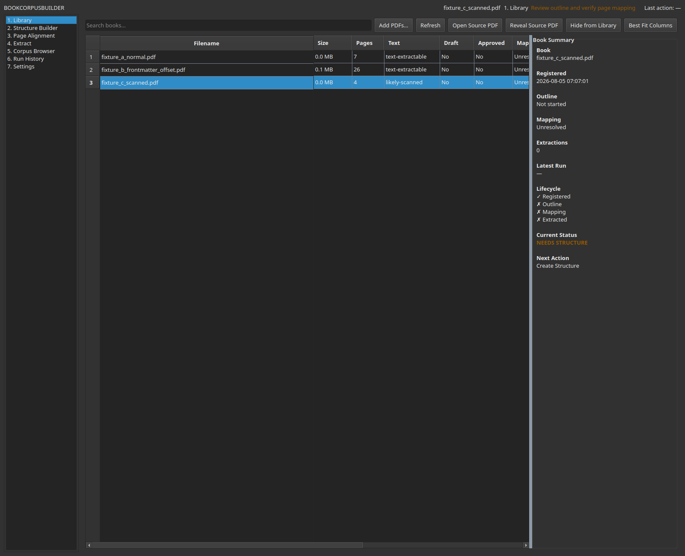

*Alt text: Library table with three rows — a normal book, a book with a page-numbering offset, and a likely-scanned book — none yet processed.*

**Steps: selecting a book and reading its status.**

1. Click a row to select that book. The header bar updates to show it as the
   active book for every other workspace.
2. Read the columns left to right:

   | Column | Meaning |
   |---|---|
   | Filename | The registered PDF's filename. |
   | Size | File size on disk. |
   | Pages | Physical page count. |
   | Text | `text-extractable` or `likely-scanned` (Chapter 17). |
   | Draft | Whether an outline draft exists. |
   | Approved | Whether the outline has been approved. |
   | Mapping | `Unresolved` or `Verified`. |
   | Extraction | Whether at least one completed extraction run exists. |
   | Last Run | The status of the most recent run, if any. |

**Figure 6 — a specific book selected**, showing its row highlighted.

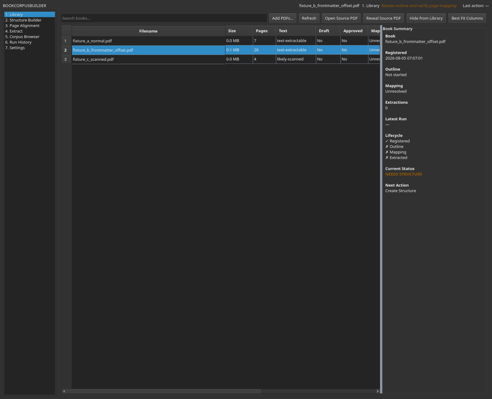

*Alt text: Library table, second row (a book with a page-numbering offset) selected and highlighted blue.*

**Steps: other Library actions.**

- **Open Source PDF** — opens the selected book's PDF in your operating
  system's default PDF viewer (external to BOOKCORPUSBUILDER).
- **Reveal Source PDF** — opens your file manager at the PDF's location on disk.
- **Hide from Library** — asks for confirmation, then hides the book from
  the Library table. This does **not** delete the imported PDF or its
  original source file; it only stops the book from appearing in the list.
  Re-adding the same PDF later (Add PDFs…, selecting the same file again)
  brings it back — see Recovery below.
- **Refresh** — re-scans every registered PDF's page count and text status
  (useful if a file changed on disk outside the application).

**Common mistake.** Assuming "Hide from Library" deletes files. It does
not — it only hides the entry. To free disk space, delete the file from the
Input Pdf Dir yourself afterward.

**Recovery.** Two distinct situations, both handled automatically:

- If you add the same PDF twice under different filenames while it's still
  visible in the Library, the second add is refused with a persistent
  dialog naming the existing registration — select that existing entry
  instead of trying to re-add.
- If you previously used **Hide from Library** on a book and then re-add
  the same source PDF, it is restored (un-hidden) rather than refused —
  Add PDFs… is the way back for a hidden book, since hidden entries don't
  appear anywhere in the table to select from directly.

---

# 7. Structure Builder — choosing an outline source

Structure Builder has two tabs:

```text
A. Create Structure   — bring in candidate rows from any source, then review them
B. Review Outline     — edit the canonical draft, then save/approve it
```

**Supported sources**, exactly as shown in the "1 · Choose a structure source"
row of tab A:

- **Paste outline** — type or paste a table of contents (Chapter 8).
- **Detect from PDF** — run the deterministic layout/TOC parser
  (`bookcorpusbuilder.outline.extract_outline_from_pdf`) against the selected
  book's native PDF text.
- **Import CSV…** — load a previously exported outline CSV.
- **Import JSON…** — load a `BOOK_OUTLINE_CONTRACT_v1` structured JSON outline
  (a schema-validated format; malformed or mismatched-book JSON is rejected
  with a diagnostic, never silently accepted).
- **Generate with Ollama…** — optionally ask a local Ollama model to propose
  structured candidates from pasted source text. This is the one place the
  application can call an AI model, and only on your explicit action; its
  output is schema-validated and lands in the same review-before-approval
  candidate table as every other source. It requires a local Ollama server;
  it was not exercised for this manual.
- **Build manually** — add a single blank candidate row to fill in by hand.

**Three states, not two:**

```text
candidate   — a row currently in the "3 · Parsing preview" table on tab A.
              Purely scratch space.
draft       — the canonical outline for this book, saved but not yet approved.
approved    — the draft, hash-bound and locked, ready for page mapping.
```

> **Parsing candidates does not modify the approved outline.** You can parse,
> detect, import, and delete candidates freely on tab A without any risk to an
> already-approved outline — nothing on tab A is written anywhere until you
> explicitly press **Merge into Current Draft** or **Create New Outline**.

**Figure 7 — Structure Builder, tab A, before any source has been chosen.**

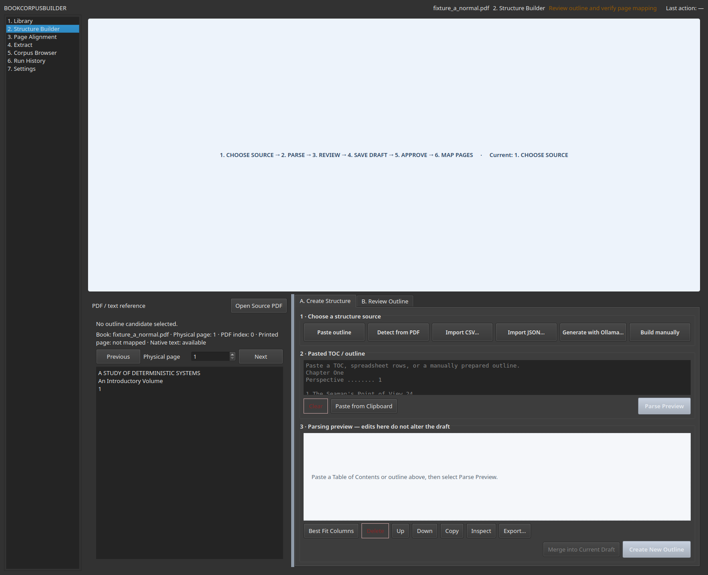

*Alt text: Structure Builder with tabs "A. Create Structure" and "B. Review Outline"; tab A active, showing six source buttons and an empty paste box.*

---

# 8. Structure Builder — pasting and parsing an outline

**Purpose.** Turn a pasted table of contents into reviewable candidate rows.

**Before you begin.** Select a book in Library first — every action in
Structure Builder requires an active book.

**Steps.**

1. In tab A, click into the **2 · Pasted TOC / outline** box (or press the
   **Paste outline** button, which only moves focus there).
2. Paste or type your outline, one entry per line, in either a
   dot-leader/spaced TOC style or a `Sno,Title,Page` style. For example, for a
   book whose real chapters open at printed pages 3, 5, and 7:

   ```text
   Foundations .......... 3
   Structures .......... 5
   Continuity .......... 7
   ```

3. Press **Parse Preview**.

**Figure 8 — pasted text, not yet parsed.**

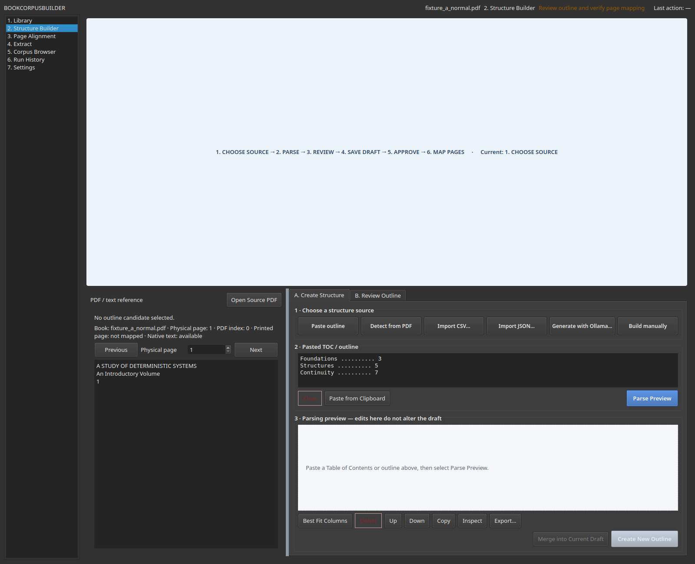

*Alt text: Paste box containing three TOC-style lines; parsing preview table still empty below it.*

4. Inspect the **3 · Parsing preview** candidate table. Its columns are:

   | Column | Meaning |
   |---|---|
   | Include | Whether this candidate will be used if you accept the batch. |
   | Sno | Section number, auto-assigned but editable. |
   | Title | The parsed title text. |
   | Kind | `section`, `chapter`, `part`, etc. |
   | Printed Page | The page number parsed from your text. |
   | Level | Outline nesting depth. |
   | Source | Which mechanism produced this row (`pasted_text`, `pdf_toc`, `pdf_heading`, `csv_import`, …). |
   | Confidence | A deterministic confidence score for detected (not pasted/imported) candidates. |
   | Warning | A short code if something needs attention (see below). |

**Figure 9 — after Parse Preview**, showing three clean candidate rows.

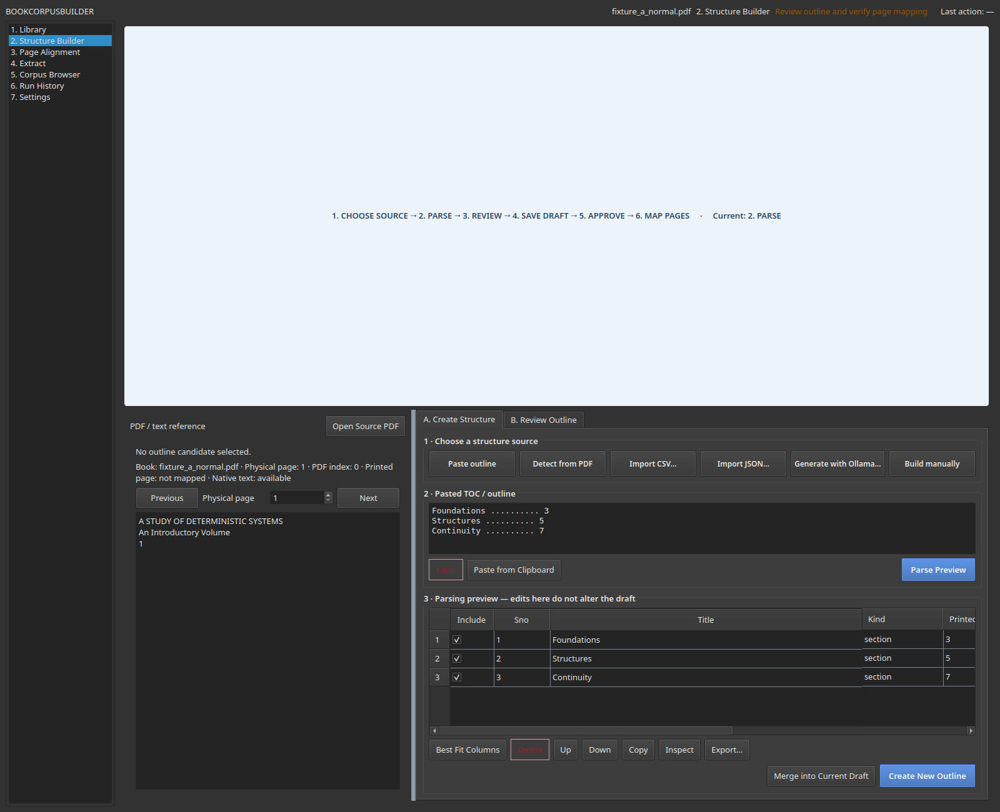

*Alt text: Candidate table with three rows, all Include-checked, kind "section", source "pasted_text".*

5. **Edit a title or page** by double-clicking its cell.
6. **Exclude a candidate** by unchecking its Include box — it stays visible
   for reference but will not be written into the draft.
7. **Inspect raw source** by selecting a row and reading the detail panel
   beneath the table (shows the original text and the parser rule that
   matched it).
8. **Reorder rows** with the **Up**/**Down** buttons.
9. **Export candidates** with the **Export…** button, if you want a CSV copy
   of the current preview before deciding what to keep.
10. Accept the reviewed candidates:
    - **Create New Outline** replaces the book's entire draft with the
      checked candidates (confirmation required if a draft or approval
      already exists).
    - **Merge into Current Draft** instead reconciles the checked candidates
      against the existing draft (Chapter 7's "candidate vs. draft"
      distinction) and shows a merge preview before applying anything.
11. Resolve conflicts conservatively: when the merge preview flags a
    conflicting page or a duplicate, prefer keeping the existing, already-
    reviewed draft value unless you have specifically re-verified the new one
    against the PDF.

**Examples of warning codes you may see** (from
`bookcorpusbuilder.gui.widgets.structure_builder`):

| Warning | Meaning |
|---|---|
| `missing_page` | The candidate has no printed page number at all. |
| `ambiguous_page` | The printed page could not be resolved to one confident value; **Create New Outline** is blocked until this is fixed or the row is excluded. |

Duplicate `Sno` and directly conflicting pages are surfaced the same way — as
a row-level warning in this table, or as a named conflict in the merge preview
when merging into an existing draft — never silently resolved for you.

**Common mistake.** Pressing **Create New Outline** while a genuinely
ambiguous-page candidate is still included. The application blocks this
specific case with a message naming the problem; correct the page or exclude
the row, then try again.

**Recovery.** Nothing here is destructive until you press **Create New
Outline** or **Merge into Current Draft** — if a parse goes wrong, just paste
again and press **Parse Preview** to start over.

---

# 9. Structure Builder — reviewing and approving the outline

**Purpose.** Turn a draft outline into an approved, hash-bound outline ready
for page mapping.

**Steps.**

1. Switch to tab **B. Review Outline** (this happens automatically after
   **Create New Outline**, or click the tab directly).
2. Inspect the canonical outline table — the same book, now in its
   draft/approved form rather than scratch-candidate form. Columns: Include,
   Sno, Title, Kind, Printed Start, Physical Start, PDF Index, Level, Source,
   Review Status, Semantic Status.
3. Resize and move columns as needed (Chapter 4).
4. Check, in order: every row you want is **Include**d; **Sno** values are
   unique and in a sensible order; the hierarchy (**Level**) matches the
   book; **Printed Start** matches what is actually printed on the page;
   **Kind** and **Source** are what you expect.
5. Read the validation panel beside the table. It is grouped into three
   sections, always in this order:

   ```text
   BLOCKING ERRORS   — must be fixed before approval can succeed
   WARNINGS          — approval is still possible; review before proceeding
   PASSED CHECKS     — confirmation that a specific check succeeded
   ```

**Figure 10 — the Review Outline tab**, after creating a draft from three
approved candidates.

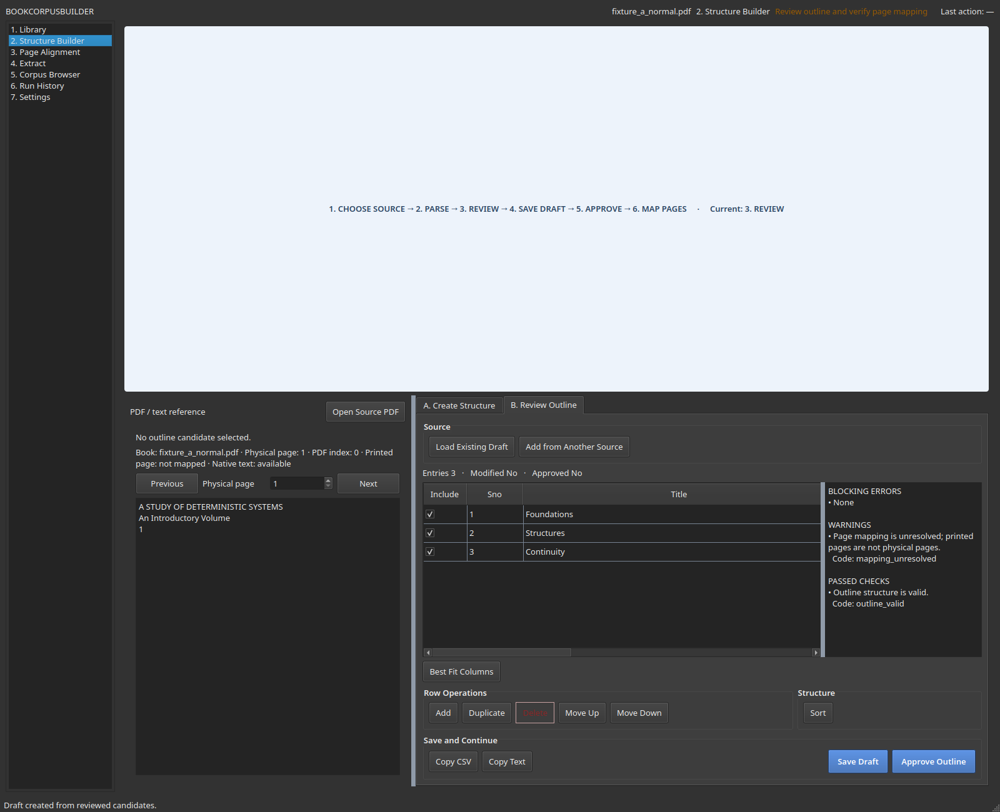

*Alt text: Canonical outline table with three rows and a validation panel reading BLOCKING ERRORS: None, WARNINGS: page mapping unresolved, PASSED CHECKS: outline valid.*

6. Use **Add**, **Delete**, **Duplicate**, **Move Up**, **Move Down**, and
   **Sort** to correct the table directly if needed.
7. Press **Save Draft** at any point to persist changes without approving.
8. Press **Approve Outline** when the table is correct. You will be asked for
   a short reviewer note; supply one (even a short one — it is stored with the
   approval record).
9. **Understand the approval hash.** Approval computes and stores the
   SHA-256 of both the approved outline file and the source PDF at that exact
   moment (Chapter 2). This is what lets the application later detect "the
   book changed after I approved this" or "the outline changed after I
   approved this."
10. **Editing after approval invalidates it in effect, not in place.** The
    approved file is protected — editing rows and pressing **Create New
    Outline** again creates a *separate* revised draft rather than silently
    overwriting the protected approval; you explicitly revoke the old
    approval (the application will ask) before a new one can replace it.

> **Do not approve analytical rows as extraction boundaries unless their page
> starts are verified.** A row detected from an internal sub-heading or
> thematic aside is not automatically a real section break — read Chapter 2
> again if this is not clear before approving your first real book.

Approving successfully navigates you directly to **3. Page Alignment** —
that is the next required step, not an optional one, since printed page
numbers are not yet verified physical pages.

---

# 10. Page Alignment — conceptual explanation

This is the most important chapter in this manual. Read it fully before
verifying your first book's page mapping.

## The coordinate chain

```text
Printed page   (the number printed on the page itself, e.g. "21")
   ↓
Physical page  (that page's 1-based position in the actual PDF file, e.g. 24)
   ↓
PDF page index (the same position, 0-based, as pdfplumber/most PDF
                libraries address it, e.g. 23)
```

Front matter (title pages, a table of contents, a preface, roman-numeral
pages) sits *before* printed page 1 in the physical file. A book with three
such pages has printed page 1 sitting at physical page 4 — an offset of +3
that is completely invisible if you only ever look at printed numbers.

## Definitions

| Term | Meaning |
|---|---|
| **Printed page** | The number printed on the page. |
| **Physical page** | The page's real 1-based position in the PDF file. |
| **PDF page index** | Physical page minus one (0-based addressing). |
| **Verification anchor** | One specific printed-page-to-physical-page pair you have personally checked and recorded. |
| **Offset** | Physical page minus printed page, for one anchor. |
| **Segment** | A contiguous range of printed pages sharing one confirmed offset. |
| **Confirmed segment** | A segment backed by **two or more agreeing anchors** — never trusted on a single anchor alone. |
| **Unconfirmed segment** | A segment with only one anchor so far; its offset is not yet trusted for any page other than that anchor's own. |
| **Exception** | A single printed page whose physical location you record directly, overriding whatever offset would otherwise apply (for genuinely irregular pages). |
| **Extrapolated mapping** | A page resolved by applying the *one and only* confirmed segment's offset beyond that segment's own anchor range — only ever done when there is no competing segment to make that guess ambiguous. |
| **Unresolved entry** | An outline entry whose printed page cannot currently be converted to a physical page at all. |

## Why one book can need multiple segments

- **Roman-numeral front matter**, as above: the body of the book has a
  different, later offset than the preface.
- **Inserted plates or photo sections** that are physically present in the
  PDF but are not part of the printed pagination — pages after the insert
  need a different offset than pages before it.
- **Omitted or duplicate scans** in the source PDF — a page repeated or
  missing changes the offset from that point forward.
- **Genuinely different offsets in different volumes** bound together as one
  PDF.

BOOKCORPUSBUILDER's mapping model handles this by looking for **maximal runs
of anchors that agree on one offset** and treating each run as its own
segment, rather than assuming the whole book shares a single offset. A
segment needs two agreeing anchors to be trusted for any page beyond the
anchors themselves.

## The idea in one picture

```text
Printed:    1                          10                         21
            |---------- +3 ------------|---------- +3 -------------|
Physical:   4                          13                         24

One confirmed segment, offset +3, covering printed pages 1 through 21.
A printed page far outside any anchor (say, printed page 500 in a much
longer book) is NOT safely covered by this segment and must either get
its own nearby anchor, or remain correctly reported as unresolved.
```

---

# 11. Page Alignment — buttonology

Every control described here is visible in Figure 11.

**Figure 11 — the Page Alignment workspace**, immediately after opening it for
a freshly-approved outline.

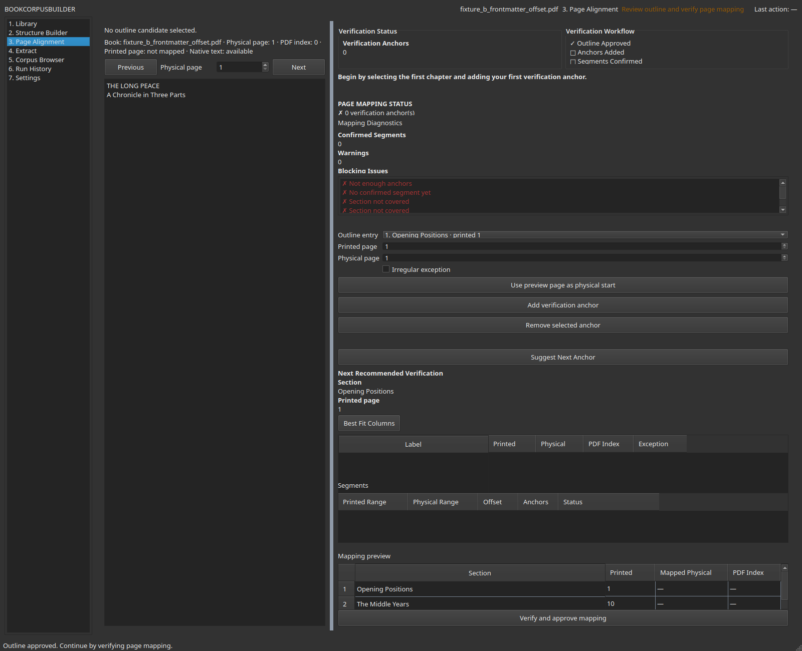

*Alt text: Page Alignment workspace with a red "unresolved" status panel, an empty anchor table, and an outline entry dropdown populated with three chapters.*

Callouts:

1. **PDF preview controls** (left pane) — **Previous** / **Physical page**
   field / **Next** step through the PDF one physical page at a time; the
   pane below them shows that page's extracted native text, for visual
   verification against the outline entry you are working on.
2. **Outline entry** selector — choose which approved outline row you are
   currently aligning.
3. **Printed page** / **Physical page** fields — the pair you are about to
   record as an anchor.
4. **Irregular exception** checkbox — check this only for a genuinely
   irregular single page (Chapter 10's "Exception"), not as a shortcut around
   verifying a normal chapter opening.
5. **Use preview page as physical start** — copies whatever physical page the
   PDF preview is currently showing into the Physical page field, so you can
   navigate visually first and record second.
6. **Add verification anchor** / **Remove selected anchor** — commit or
   retract one anchor.
7. **Suggest Next Anchor** — deterministically points you at the next
   outline entry whose printed page does not yet resolve to a physical page,
   selecting it in the Outline entry dropdown for you. It performs no PDF
   text search and computes no confidence score — it is arithmetic over the
   mapping you have already verified, not a new detection engine. It is
   disabled with the message "No unresolved entries — nothing to suggest"
   once every included entry resolves.
8. **PAGE MAPPING STATUS** panel — a running summary: anchor count, confirmed
   vs. unconfirmed segment count, and `resolved / total` outline entries,
   each with a ✓ or ✗. Below it, any BLOCKING or CONFLICT diagnostics are
   listed with a plain-language reason and a suggested corrective action.
9. **Verification Anchors** table — every anchor you have added, its
   printed/physical/PDF-index values, and whether it is marked as an
   exception.
10. **Segments** table — every segment implied by your current anchors:
    printed range, physical range, offset, anchor count, and status
    (`confirmed` or `needs a second anchor`).
11. **Mapping Preview** table — every included outline entry, its printed
    page, its currently mapped physical page (if any), and a **Resolution**
    column.
12. **Verify and approve mapping** — the final action; blocked while any
    BLOCKING diagnostic remains.

**Resolution values**, exactly as they appear in the Mapping Preview table:

| Value | Meaning |
|---|---|
| `anchor` | This exact printed page was anchored directly — the most trustworthy resolution. |
| `segment` | This page falls inside a confirmed segment's range. |
| `extrapolated` | Resolved by projecting the sole confirmed segment's offset beyond its own anchor range (only when no other segment could disagree). |
| `unresolved` | No anchor, confirmed segment, or safe extrapolation currently covers this page. |

Segment-table status values are `confirmed` (two or more agreeing anchors) or
`needs a second anchor` (exactly one anchor so far).

---

# 12. Page Alignment — step-by-step worked example

This walkthrough uses a practice book built specifically to demonstrate an
offset: `fixture_b_frontmatter_offset.pdf`, whose three unnumbered front-matter
pages push printed page 1 to physical page 4.

```text
Printed page 1  → Physical page 4  → PDF index 3
Printed page 10 → Physical page 13 → PDF index 12
Printed page 21 → Physical page 24 → PDF index 23
```

**Steps.**

1. With the book's outline already approved (Chapter 9), open **3. Page
   Alignment**. The Outline entry dropdown lists all three chapters; nothing
   is anchored yet (Figure 11 above).
2. Select the first chapter ("Opening Positions", printed 1) in the Outline
   entry dropdown.
3. Use the PDF preview's **Physical page** field (or **Next**) to navigate to
   the book's actual chapter opening — in this example, physical page 4 — and
   read the extracted text to confirm it really is "CHAPTER ONE / Opening
   Positions", not a table-of-contents mention of it.
4. Press **Use preview page as physical start** (or type `4` directly into
   the Physical page field).
5. Press **Add verification anchor**.

**Figure 12 — after the first anchor.**

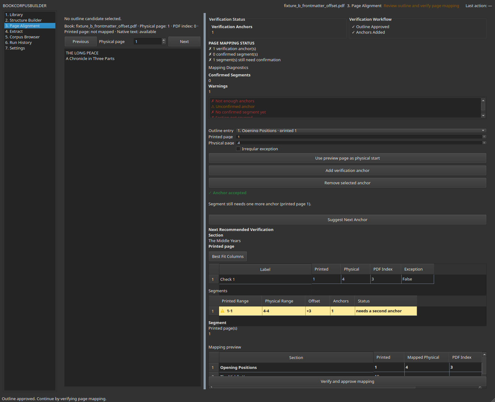

*Alt text: One row in the Verification Anchors table; the Segments table shows one segment, "needs a second anchor".*

6. Select a distant chapter ("The Middle Years", printed 10). Repeat steps 3–5,
   confirming it opens at physical page 13.

**Figure 13 — after the second anchor**, now forming a confirmed segment.

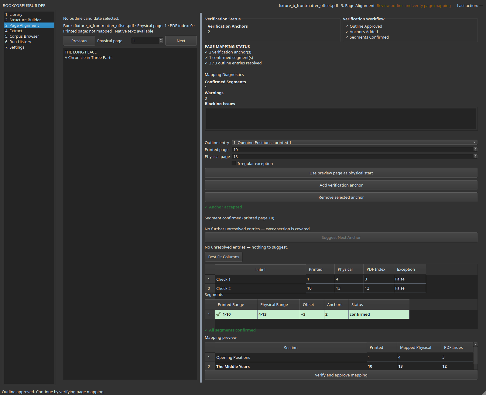

*Alt text: Two rows in the Verification Anchors table; Segments table shows one confirmed segment, printed 1-10, offset +3.*

7. Repeat once more for the third chapter ("Settlement", printed 21, physical
   24) — because it agrees with the same +3 offset, it extends the *same*
   confirmed segment rather than creating a second one.
8. Inspect **Mapping Preview** — every entry should now show `anchor` or
   `segment` in its Resolution column, and the status panel should read `3 /
   3 outline entries resolved`.
9. If **Suggest Next Anchor** is still enabled at this point, it names the
   next entry that does not yet resolve — add an anchor for it and repeat.
10. Press **Verify and approve mapping**.

**Figure 14 — the approved mapping.**

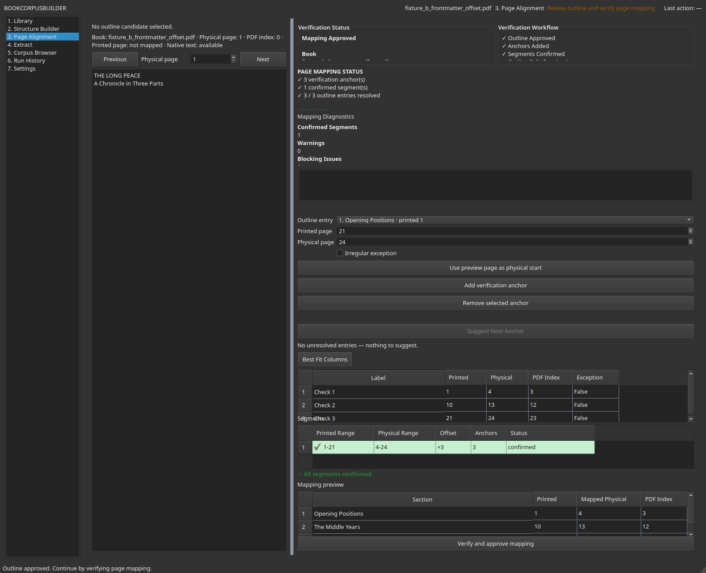

*Alt text: Green APPROVED banner, three confirmed anchors, one confirmed segment covering printed 1-21, Suggest Next Anchor disabled.*

**Expected result.** The status panel turns green and reads **APPROVED**; the
**Extract** workspace's preflight (Chapter 13) will now allow this book
through.

## Examples of blocked approval, and their corrective action

| Situation | What you will see | Corrective action |
|---|---|---|
| One-anchor segment | `segment_unconfirmed` warning naming the anchor | Add a second, agreeing anchor near it. |
| Uncovered entry | `uncovered_entry`, blocking, naming the section and printed page | Add an anchor near that printed page. |
| Conflicting anchors | `offset_conflict`, blocking, naming both anchors and their disagreeing physical pages | Correct or remove one of the two anchors, or mark the irregular one as an exception. |
| Out-of-range physical page | `anchor_out_of_range`, blocking | Re-check the physical page number — it exceeds the PDF's actual page count. |

---

# 13. Extraction workspace

**Purpose.** Turn an approved outline plus an approved mapping into an
extracted corpus.

**Before you begin.** The selected book must have both an approved outline
(Chapter 9) and an approved page mapping (Chapter 12). Extraction is disabled
until every blocking prerequisite passes — this is not a limitation to work
around, it is the point.

**Steps.**

1. Open **4. Extract** with the prepared book selected.
2. Set **Minimum characters** if you want very short (likely noise) sections
   silently skipped rather than written as near-empty files.
3. Review **Output root** — where this run's files will be written. Change it
   with **Choose Output…** if needed.
4. Press **Validate / Dry Run**. This runs the full preflight check without
   writing anything.

**Figure 15 — a passing preflight.**

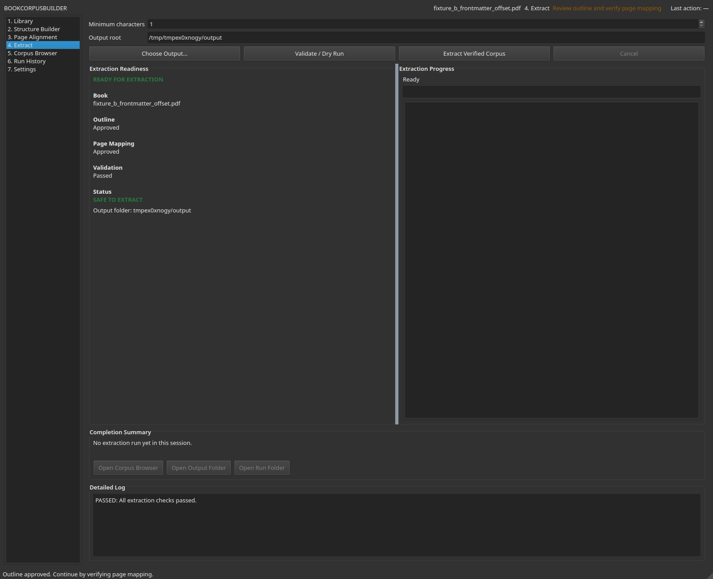

*Alt text: Extraction workspace log panel reading PASSED: All extraction checks passed, Extract button now enabled.*

5. Read the log. Each line is one diagnostic, prefixed `PASSED`, `WARNING`, or
   `BLOCKING`. The **Extract Verified Corpus** button only enables itself once
   there are zero `BLOCKING` lines.
6. Press **Extract Verified Corpus**.

**Figure 16 — extraction in progress.**

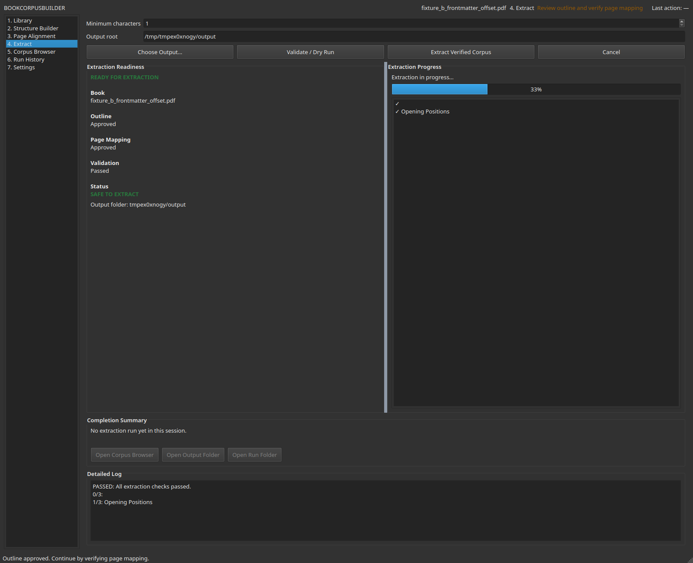

*Alt text: Progress bar and log lines "1/3: Opening Positions", "2/3: The Middle Years", building up.*

7. Monitor the progress bar and the log, which reports each section as it
   completes.
8. On completion, the log reports **expected**, **written**, **skipped**, and
   **failed** counts, plus the exact output folder for this run.

**Figure 17 — a completed run.**

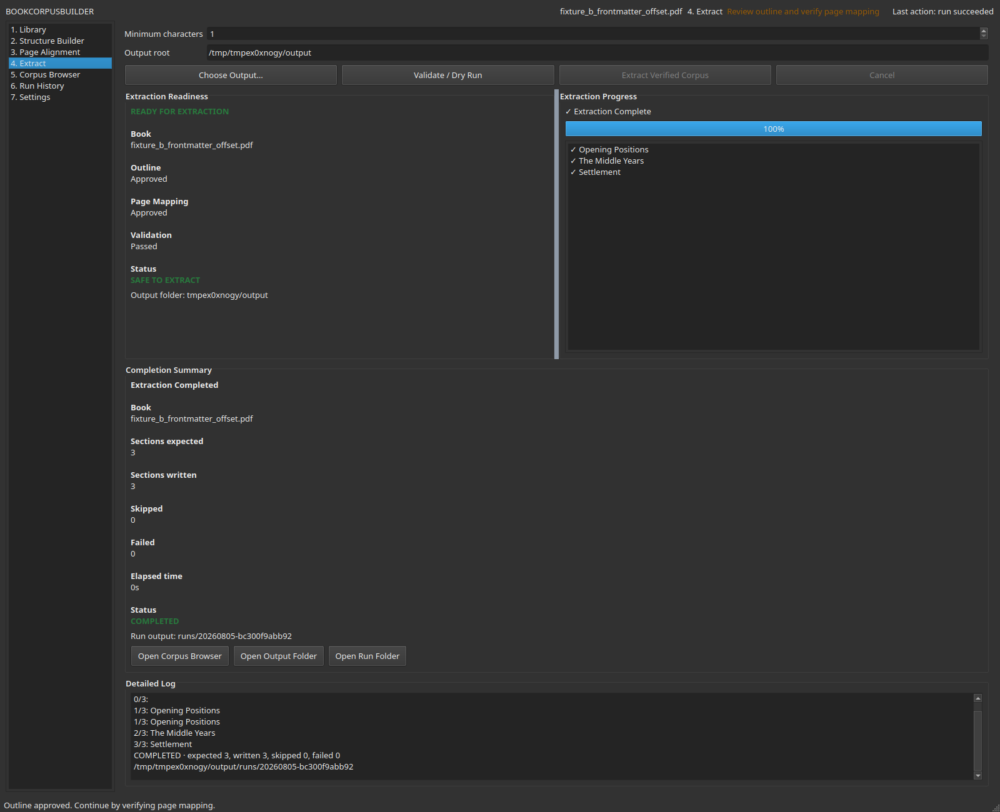

*Alt text: Log ending with COMPLETED, expected 3, written 3, skipped 0, failed 0, and the run's output folder path.*

9. **Cancel** stops an in-progress run; its partial, temporary output is
   discarded rather than promoted to a real run folder (Chapter 2).
10. **Atomic promotion**: a run's output only becomes visible under its final
    run-ID folder once every file has been written successfully — a run that
    fails partway through does not leave a folder that looks complete.

**Common mistake.** Expecting **Extract Verified Corpus** to become available
immediately after approving a mapping, without running **Validate / Dry Run**
first. The button only enables after a dry run reports zero blocking issues —
run the dry run explicitly, every time, even if you are confident.

**Recovery.** If the dry run reports a blocking issue, its message names the
exact problem (an unapproved outline, an unapproved mapping, a source-PDF
hash mismatch, and so on) — resolve that specific problem in the workspace it
belongs to, then dry-run again.

---

# 14. Corpus Browser

**Purpose.** Search extracted text across one book or your whole corpus,
inspect a result in context, and jump straight to its source page in the
original PDF.

**Steps.**

1. Open **5. Corpus Browser**.
2. Optionally choose a specific book (via Library selection) and/or a
   specific extraction run in the **All runs** dropdown — leave both at their
   "All" defaults to search everything.
3. Type a phrase into the search box and press **Search** (or Enter).
4. Filter further with **All kinds** (section kind), **Printed from** / **to**
   (a printed-page range), or the run filter above.
5. Read the results list — each entry shows its title and a short snippet
   around the match. The first result is shown in the preview panes
   automatically as soon as the search completes — you do not need to click
   it yourself unless you want to view a *different* result.

**Figure 18 — a search in progress.**

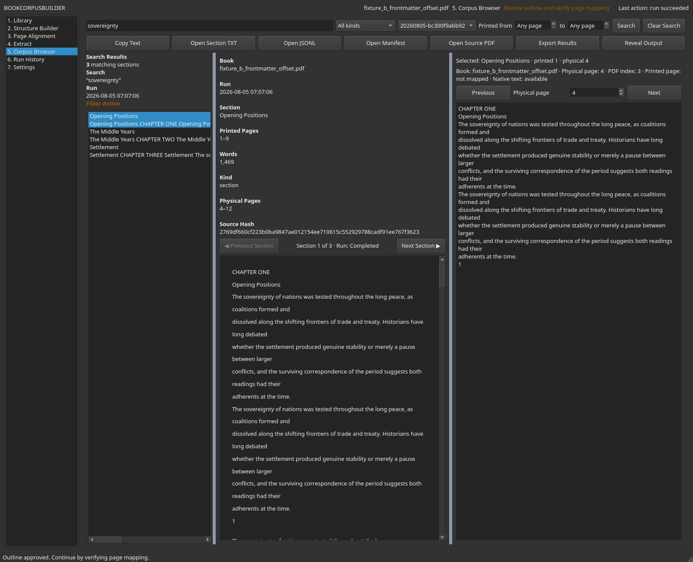

*Alt text: Search box containing "sovereignty", three results listed on the left, each with a snippet.*

6. Select a result to preview its full section text, metadata (book, kind,
   printed/physical page range, run ID, source PDF hash), and — in the third
   pane — the exact physical page of the original PDF it came from, jumped to
   automatically.

**Figure 19 — a result selected, with its source page shown.**


*Alt text: Three-pane Corpus Browser — results list, full extracted text, and a PDF preview pane showing matching source text on the correct physical page.*

7. **Copy Text** copies the currently previewed section's full text to the
   clipboard.
8. **Open Section TXT** / **Open JSONL** / **Open Manifest** open the underlying
   export files for the selected result in their default application — these
   three files are the corpus's authoritative, portable export; the in-app
   browser is a convenience layer on top of them, not a replacement for them.
9. **Open Source PDF** opens the original PDF externally; the in-app preview
   pane (callout 6 above) already shows the matching page without leaving the
   application.
10. **Reveal Output** opens your file manager at that run's output folder.
11. **Export Results** saves the current result set as a JSON file you choose.

**Common mistake.** Searching with a run selected in the run filter and
getting zero results because that particular run does not contain the term —
check whether **All runs** is selected before concluding a phrase is not in
the corpus at all.

---

# 15. Run History

**Purpose.** Audit every extraction run — not just the most recent one.

Before any run has ever completed, this workspace shows "No extraction runs
recorded" together with a "Next Step" pointing you to Extract (Workspace 4) —
the same why-then-what-next pattern every empty workspace in this
application uses.

**Steps.**

1. Open **6. Run History**.
2. Select a book in Library to filter to that book's runs, or clear the
   selection to see every run across the whole profile.
3. Read the table: **Run ID**, **Started**, **Status** (`completed`,
   `failed`, or `cancelled`), **Book**, **Expected**/**Written**/**Skipped**/
   **Failed** counts, and **Output** location.

**Figure 20 — run history after one completed run.**

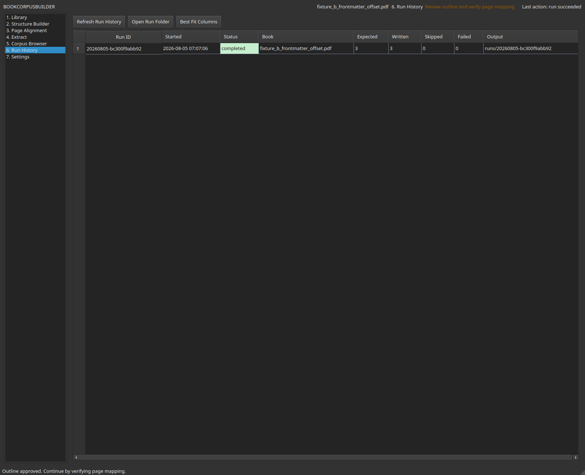

*Alt text: Run History table, one row, status "completed", expected 3, written 3, skipped 0, failed 0.*

4. Select a row and press **Open Run Folder** to open that specific
   run's output folder — including runs that are not the most recent one.
5. **Previous successful runs are never overwritten** by a later run against
   the same book: each run gets its own timestamped folder (Chapter 2).

Failed or cancelled runs remain listed here too, with their status and
whatever partial counts were recorded, so a failure is never silently lost —
only its output is withheld from promotion (Chapter 13).

---

# 16. Output folders and files

Every extraction run produces the following, under the run's own timestamped
folder inside **Output Dir**:

```text
data/output/
├── run_history/
│   └── <run-id>.json              — one run record (Run History reads these)
└── runs/
    └── <run-id>/
        ├── sections/<book-id>/    — one TXT file per extracted section
        ├── jsonl/                 — one JSONL file, one line per section
        └── manifests/             — one manifest CSV per book, one row per section
```

Outline and page-mapping sidecars live alongside each other under **Outline
Dir**, one set per book (`<book-id>_outline.csv`, `<book-id>_outline_clean.csv`,
`<book-id>_approval.json`, `<book-id>_page_mapping.json`).

**Figure 21 — a real output folder tree**, from the run captured for this
manual.

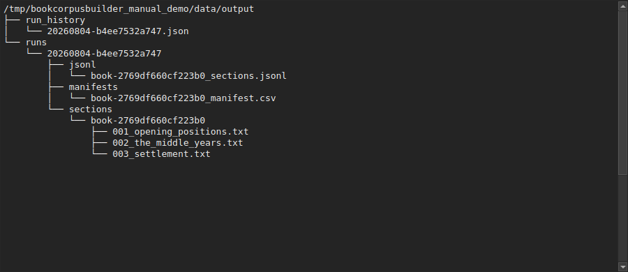

*Alt text: Text folder-tree listing of one extraction run's output directory.*

| Folder/file | Purpose |
|---|---|
| `sections/<book-id>/NNN_title.txt` | The extracted text of one section, human-readable. |
| `jsonl/<book-id>_sections.jsonl` | The same sections as one machine-readable record per line, including full provenance fields (printed/physical/PDF-index, source hash, run ID). |
| `manifests/<book-id>_manifest.csv` | A spreadsheet-friendly index of every section written in this run. |
| `run_history/<run-id>.json` | The run record Run History reads (Chapter 15). |
| `<book-id>_outline_clean.csv` | The approved outline (Chapter 9). |
| `<book-id>_approval.json` | The approval's hash-binding record (Chapter 2). |
| `<book-id>_page_mapping.json` | The approved page mapping (Chapters 10–12). |

No other output file types are currently produced — if you find a file under
these folders not described above, treat it as worth reporting rather than
assuming it is expected.

---

# 17. Scanned PDFs

**Purpose.** Understand what BOOKCORPUSBUILDER can and cannot do with a
scanned (image-only) PDF.

- **Likely-scanned detection** is automatic: on registration, Library reads
  the first three pages' native text; if fewer than 80 characters of text are
  found across those three pages, the book is marked `likely-scanned` rather
  than `text-extractable` (visible in the Library table, Chapter 6).
- **OCR availability** (Settings, Chapter 5) only reports whether a
  `tesseract` binary is present on this machine's `PATH`. **It does not mean
  BOOKCORPUSBUILDER performs OCR** — nothing in the current application
  invokes OCR at any stage, on any book, regardless of what this field shows.
  OCR execution is explicitly out of scope for v1 (`docs/GOVERNANCE.md`).
- **Why no false outline should be accepted:** a scanned page with no native
  text layer will not produce real TOC or heading candidates from the
  deterministic parser — any candidates that do appear from such a book
  should be treated with particular suspicion, since they cannot be
  confirmed against real extracted text the way a native-text book's can.
- **Extraction may remain effectively empty** for a likely-scanned book: the
  extractor pulls native text per page, and a page with no text layer
  contributes nothing to its section's output, even if the outline and
  mapping are both technically approved.
- **Current scope:** if you need a scanned book in the corpus, it needs to be
  OCR'd by an external tool first, producing a PDF with a real text layer,
  before BOOKCORPUSBUILDER can process it meaningfully.

---

# 18. Troubleshooting

| Message | Meaning | Operator action |
|---|---|---|
| No book selected | No active library item | Select a book in Library. |
| No usable outline entries detected | Parsing produced nothing usable | Correct the pasted text and parse again. |
| Duplicate Sno | Two rows share a section number | Renumber one of the rows. |
| Empty title | A row has no heading text | Add a title before saving/approving. |
| Page mapping unresolved / `offset_unresolved` | No confirmed segment exists yet | Add at least two agreeing anchors. |
| `segment_unconfirmed` | Only one anchor exists for that offset | Add a second, agreeing anchor nearby. |
| `uncovered_entry` | An included entry's printed page has no resolvable physical page | Add an anchor near that printed page. |
| `offset_conflict` | Two anchors on the same printed page disagree | Correct or remove one anchor, or mark it an exception. |
| `anchor_out_of_range` | A recorded physical page exceeds the PDF's page count | Re-check and correct the physical page. |
| PDF changed after approval / `approval_pdf_mismatch` | The source PDF's hash no longer matches the approval record | Re-review and re-approve; do not assume the old approval still applies. |
| OCR unavailable | No `tesseract` binary found on `PATH` | Install Tesseract if you need the status to read `available` — this does not enable OCR execution regardless (Chapter 17). |
| Extraction cancelled | You intentionally stopped a run | Restart extraction when ready; nothing was promoted from the cancelled attempt. |
| Duplicate PDF | Same SHA-256 hash already registered | Use the existing registration instead of re-adding. |

Every one of these messages, in the real application, is paired with a plain-
language "Reason" and a concrete "What you can do" next step — this is a
standard dialog structure applied consistently everywhere in the application,
not just in Page Alignment. Technical details (the exact exception and
traceback, if any) remain available behind an expandable "Show Details"
section rather than being shown by default or discarded. The technical code
above is secondary, included here so you can look a specific message up
quickly.

---

# 19. Daily operator checklist

```text
□ Select correct book
□ Review outline source
□ Check chapter titles
□ Check printed pages
□ Save draft
□ Approve outline
□ Add at least two reliable anchors per required segment
□ Resolve all included entries
□ Approve page mapping
□ Pass extraction preflight (dry run)
□ Extract
□ Search corpus
□ Confirm outputs
□ Check Run History
```

---

# 20. Quick-start guide

See "Ten-minute workflow" at the top of this manual. It is repeated here for
convenience:

```text
1.  Add PDF                 (Library)
2.  Paste or detect outline (Structure Builder → A. Create Structure)
3.  Parse                   (Parse Preview)
4.  Review                  (Structure Builder → B. Review Outline)
5.  Approve                 (Approve Outline)
6.  Map chapter pages       (Page Alignment — add anchors)
7.  Approve mapping         (Verify and approve mapping)
8.  Extract                 (Extract → Extract Verified Corpus)
9.  Search                  (Corpus Browser)
10. Open source              (Corpus Browser → Open Source PDF / in-app preview)
```

For a book with no usable table of contents, an unusual page-numbering
scheme, or any blocked/unresolved state, stop and read the relevant detailed
chapter (7–13) rather than guessing — every blocking state in this
application exists because guessing at that point would risk silently
mis-attributing text to the wrong page.

---

# 21. Glossary

| Term | Meaning |
|---|---|
| Book ID | A stable identifier derived from a PDF's SHA-256 hash; the same PDF always gets the same book ID, even re-added under a different filename. |
| Candidate | A scratch-space outline row on Structure Builder's Create Structure tab, not yet part of any draft. |
| Draft | A book's saved-but-unapproved outline. |
| Approved outline | A hash-bound, protected outline ready for page mapping. |
| Printed page | The page number printed on the page itself. |
| Physical page | The page's true 1-based position in the PDF file. |
| PDF index | Physical page minus one. |
| Anchor | One verified printed-to-physical page pair. |
| Segment | A contiguous printed-page range sharing one confirmed offset. |
| Offset | Physical page minus printed page for a given anchor or segment. |
| Exception | A single printed page's physical location recorded directly, overriding the segment offset for that one page. |
| Extrapolated mapping | A page resolved from the sole confirmed segment's offset, beyond that segment's own anchors. |
| Run ID | A unique identifier for one specific extraction run. |
| Manifest | A per-run, per-book CSV index of every section written. |
| JSONL | One JSON record per line; this project's primary machine-readable corpus export. |
| Atomic output | A run's output only appears under its final folder name once every file in it has been written successfully. |
| Likely scanned | A PDF whose first three pages together contain fewer than 80 characters of native text. |
| Provenance | The full chain from an extracted section back to its exact physical PDF page and source file hash. |
| Hash-bound approval | An approval record that stores the SHA-256 of both the outline and the source PDF at the moment of approval, to detect later drift. |

---

# 22. Governance note

BOOKCORPUSBUILDER's architecture is frozen as of v1.0. This manual documents
that accepted v1 workflow exactly as it exists — no control, workspace, or
behavior described here is planned, proposed, or aspirational.

Any conceptual addition to the application (new detection engines, AI
assistants, knowledge graphs, new workspaces, and the like) belongs in
`docs/FUTURE_IDEAS_v2.md`, not in this manual and not in the production
application. If you believe you have found a genuine defect in the behavior
described here, report it — the correct response to a limitation is a defect
report against this documented behavior, not an improvised workaround that
diverges from the accepted workflow.

See `docs/GOVERNANCE.md` for the full governance rule this note summarizes.
